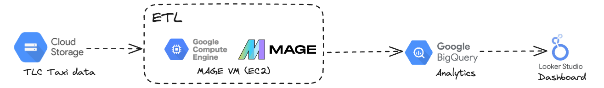

# Data Engineering Portfolio
🚀 Welcome to my GitHub data engineering portfolio! I'm Chaminda, a passionate data engineer with a deep love for transforming raw data into actionable insights. With a strong background in data architecture and ETL processes, I've worked on a range of exciting projects that showcase my skills and expertise in the field.

# Projects

[Project Name] - [Brief description of the project, its purpose, and the technologies used. Highlight any challenges overcome and results achieved.]

## [Online Retail Data Pipeline](https://github.com/chambul/data_engineering_projects/tree/main/online_retail_data_pipeline)

## [IBM Data Engineering Project](https://github.com/chambul/data_engineering_projects/tree/main/IBM_data_engineering_project/final_project)
This is the final project conducted for the course "IBM: Python Project for Data Engineering". This involves webscrapping data using APIs, developing an ETL pipeline and loading data into an SQLite database. All data operations are logged into a log file.

## [TLC Taxi Data Analysis](https://github.com/chambul/DE_projects_1/tree/main/TLC_taxi_data_analysis)

## [Danny's 8 Week SQL Challenge](https://github.com/chambul/sql_projects/tree/main/dannys_sql_case_studies) 

# Skills

# Contact

Feel free to reach out to me at chamindabulumulla@gmail.com or connect on [LinkedIn](https://www.linkedin.com/in/chaminda-bulumulla/) to discuss potential collaborations or opportunities in the field of data engineering. Thank you for visiting my portfolio, and I look forward to sharing more about my data engineering journey with you!
